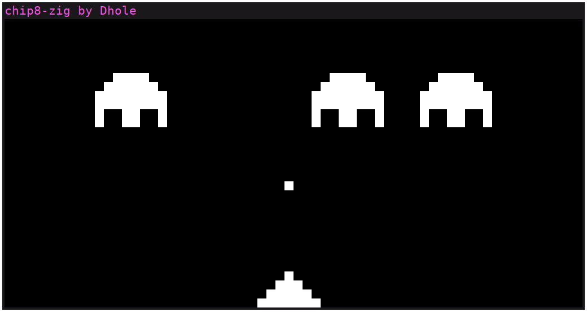

# Chip8-zig

This is a Chip8 emulator programmed in Zig.  It's the first project I've
written in Zig after learning the language.  The code structure is basically a
port of [my Chip8 emulator programmed in
Rust](https://github.com/dhole/chip8-rs)

# Building

This project uses the [gyro package manager](https://github.com/mattnite/gyro).
To build, first install gyro, and then do:
```sh
gyro build
```

gyro will pull the Zig dependencies which is only
[zig-clap](https://github.com/Hejsil/zig-clap/), a command line argument
parsing library.

For video, sound and key events I'm using SDL2 leveraging Zig's C
interoperability.  This means that to build this project you'll need the SDL2
libraries and headers installed in your system.

# Usage

```
Usage: ./zig-out/bin/chip8-zig [-h] [-s <NUM>] <ROM>
	-h, --help       	Display this help and exit.
	-s, --scale <NUM>	Scaling integer value.
```

# Screenshot



# License

GPLv3
